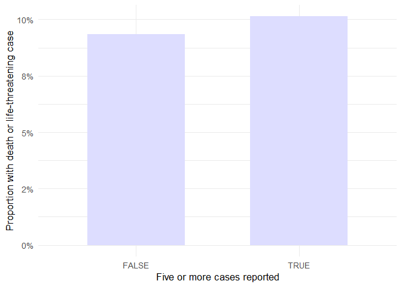

# original-code
Reina Kaino
2026-06-23

## REAC Table Overview

``` r
reac <- fread(
  "data/REAC25Q3.txt",
  sep="$",
  quote = "",
  fill = TRUE,
  encoding = "UTF-8"
)

kable(head(reac))
```

|  primaryid |   caseid | pt                         | drug_rec_act |
|-----------:|---------:|:---------------------------|:-------------|
|  100289774 | 10028977 | Fixed eruption             |              |
|  100289774 | 10028977 | Stevens-Johnson syndrome   |              |
|  100289774 | 10028977 | Toxic epidermal necrolysis |              |
| 1005762123 | 10057621 | Dyspnoea                   |              |
| 1005762123 | 10057621 | Hypotension                |              |
| 1005762123 | 10057621 | Asthma                     |              |

REAC table

### REAC Data Preparation

Data exploration of REAC table.

``` r
# Number of rows in REAC table
nrow(reac)
```

    [1] 1535133

``` r
# How many primary IDs are in the table
length(unique(reac$primaryid))
```

    [1] 438512

``` r
# How many unique case IDs are there
length(unique(reac$caseid))
```

    [1] 438512

#### Remove duplicate rows

``` r
#Remove `primaryid`
reac_new <- select(reac, -"primaryid")
```

``` r
#Remove duplicate rows
reac_new <- reac_new %>%
  distinct()
```

#### Check for missing data

``` r
kable(reac_new %>%   summarise(across(c(caseid, pt), ~sum(is.na(.)))))
```

| caseid |  pt |
|-------:|----:|
|      0 |   0 |

Check for missing data

### REAC Data Analysis

#### Frequency of reactions per case

``` r
reac_per_case <- reac_new %>%
  distinct(caseid, pt) %>%
  count(caseid, name = "Number of reaction")
#Same as reac_per_case <- reac |> dplyr::count(primaryid)
```

``` r
#Count the number of reactions per case (E.g. 100 cases have 1 reaction etc.) 
reac_count <- reac_per_case %>% count(`Number of reaction`) %>% rename(num_reactions = `Number of reaction`, num_cases = n)
kable(head(reac_count, 5))
```

| num_reactions | num_cases |
|--------------:|----------:|
|             1 |    165032 |
|             2 |     96560 |
|             3 |     56754 |
|             4 |     35258 |
|             5 |     22402 |

``` r
#Summary of number of reactions
summary(reac_per_case$`Number of reaction`)
```

       Min. 1st Qu.  Median    Mean 3rd Qu.    Max. 
       1.00    1.00    2.00    3.46    4.00  226.00 

``` r
#IQR of number of reactions
IQR(reac_per_case$`Number of reaction`)
```

    [1] 3


#### Frequently Reported Reaction Terms

``` r
top_pt <- reac_new %>%
  count(pt) %>%
  arrange(desc(n)) %>%
  rename(`Count` = n) %>%
  slice(1:10)
kable(top_pt)
```

| pt                          | Count |
|:----------------------------|------:|
| Off label use               | 30127 |
| Drug ineffective            | 24151 |
| Fatigue                     | 20698 |
| Death                       | 19165 |
| Nausea                      | 18412 |
| Diarrhoea                   | 16955 |
| Product dose omission issue | 15936 |
| Headache                    | 14143 |
| Dyspnoea                    | 13040 |
| Pain                        | 12296 |

``` r
ggplot(top_pt, aes(x = reorder(pt, -Count), y = Count)) +
  geom_col() +
  labs(x="pt") +
  theme(axis.text.x = element_text(angle = 45, vjust = 1, hjust = 1), panel.background = element_blank())
```


## OUTC Table Overview

``` r
outc <- fread(
  "data/OUTC25Q3.txt",
  sep="$",
  quote = "",
  fill = TRUE,
  encoding = "UTF-8"
)

kable(head(outc))
```

|  primaryid |   caseid | outc_cod |
|-----------:|---------:|:---------|
|  100289774 | 10028977 | HO       |
|  100289774 | 10028977 | OT       |
| 1005762123 | 10057621 | HO       |
|  100789263 | 10078926 | DE       |
|  101573482 | 10157348 | HO       |
|  101573482 | 10157348 | OT       |

Convert OUTC25Q3.txt to a table

### OUTC Data Preparation

``` r
knitr::kable(head(outc %>%
  summarise(across(c(primaryid, caseid, outc_cod), ~sum(is.na(.))))))
```

| primaryid | caseid | outc_cod |
|----------:|-------:|---------:|
|         0 |      0 |        0 |

Checking for any missing data

``` r
#Remove `primaryid` and any duplicate rows
outc_cleaned <- outc %>%
  distinct() %>%
  select(-primaryid)
```

### OUTC Data Analysis

``` r
top_outc <- outc_cleaned %>%
  count(outc_cod) %>%
  arrange(desc(n))
kable(top_outc)
```

| outc_cod |      n |
|:---------|-------:|
| OT       | 191229 |
| HO       |  91722 |
| DE       |  34803 |
| LT       |  15461 |
| DS       |   7226 |
| CA       |   1758 |
| RI       |   1052 |

Count of Outcome Code


``` r
outc_serious <- outc_cleaned %>%
  filter(outc_cod == "DE" | outc_cod == "LT")

outc_moderate <- outc_cleaned %>%
  filter(outc_cod == "HO")

outc_non_serious <- filter(outc_cleaned, outc_cod %in% c("OT", "DS", "CA", "RI"))


# Combine into a summary data frame for plotting
outc_category_count <- data.frame(
  category = c("Serious", "Moderate", "Non-Serious"),
  total_count = c(nrow(outc_serious), nrow(outc_moderate), nrow(outc_non_serious))
)

ggplot(outc_category_count, aes(reorder(x=category, -total_count), y=total_count)) +
  geom_col() +
  labs(x = "Category", y = "Count") +
  theme_minimal()
```


### Combining REAC and OUTC Tables

``` r
reac_summary <- data.table(
  caseid = reac_per_case$caseid,
  n_reactions = reac_per_case$`Number of reaction`,
  five_or_more_reactions = reac_per_case$`Number of reaction` >= 5
)

kable(head(reac_summary, 10))
```

|  caseid | n_reactions | five_or_more_reactions |
|--------:|------------:|:-----------------------|
| 3731857 |           3 | FALSE                  |
| 4119816 |           1 | FALSE                  |
| 4197637 |           2 | FALSE                  |
| 5815921 |           9 | TRUE                   |
| 5821261 |           6 | TRUE                   |
| 5962033 |           5 | TRUE                   |
| 6047261 |           3 | FALSE                  |
| 6171681 |           2 | FALSE                  |
| 6171682 |           5 | TRUE                   |
| 6171684 |           2 | FALSE                  |

Summarised REAC table

``` r
#Categorise cases
outc_serious$Severity <- "Severe"
outc_moderate$Severity <- "Moderate"
outc_non_serious$Severity <- "Non-Serious"

outc_summary <- bind_rows(outc_serious, outc_moderate, outc_non_serious)

kable(head(outc_summary, 10))
```

|   caseid | outc_cod | Severity |
|---------:|:---------|:---------|
| 10078926 | DE       | Severe   |
| 10346795 | DE       | Severe   |
| 10410135 | DE       | Severe   |
| 10427284 | DE       | Severe   |
| 10427284 | LT       | Severe   |
| 10449048 | DE       | Severe   |
| 10463057 | DE       | Severe   |
| 10597316 | LT       | Severe   |
| 10621415 | LT       | Severe   |
| 10732078 | DE       | Severe   |

Summarised OUTC table

``` r
reac_outc <- reac_summary %>%
  left_join(outc_summary, by = "caseid")

kable(head(reac_outc, 15))
```

|  caseid | n_reactions | five_or_more_reactions | outc_cod | Severity    |
|--------:|------------:|:-----------------------|:---------|:------------|
| 3731857 |           3 | FALSE                  | DE       | Severe      |
| 3731857 |           3 | FALSE                  | HO       | Moderate    |
| 3731857 |           3 | FALSE                  | OT       | Non-Serious |
| 4119816 |           1 | FALSE                  | HO       | Moderate    |
| 4197637 |           2 | FALSE                  | DE       | Severe      |
| 4197637 |           2 | FALSE                  | OT       | Non-Serious |
| 5815921 |           9 | TRUE                   | HO       | Moderate    |
| 5815921 |           9 | TRUE                   | DS       | Non-Serious |
| 5821261 |           6 | TRUE                   | DE       | Severe      |
| 5821261 |           6 | TRUE                   | HO       | Moderate    |
| 5821261 |           6 | TRUE                   | OT       | Non-Serious |
| 5962033 |           5 | TRUE                   | DE       | Severe      |
| 5962033 |           5 | TRUE                   | HO       | Moderate    |
| 6047261 |           3 | FALSE                  | DE       | Severe      |
| 6047261 |           3 | FALSE                  | LT       | Severe      |

Combining Reaction and Outcome Summary Table

``` r
kable(reac_outc %>%
  summarise(across(c(caseid, outc_cod, Severity, n_reactions, five_or_more_reactions), ~sum(is.na(.)))))
```

| caseid | outc_cod | Severity | n_reactions | five_or_more_reactions |
|-------:|---------:|---------:|------------:|-----------------------:|
|      0 |   184126 |   184126 |           0 |                      0 |

Check for missing data

``` r
ggplot(reac_outc, aes(x = Severity)) +
  geom_bar() +
  theme_minimal()
```


``` r
kable(reac_outc %>%
  count(Severity) %>%
  mutate(percentage = n / sum(n) * 100))
```

| Severity    |      n | percentage |
|:------------|-------:|-----------:|
| Moderate    |  91722 |  17.392112 |
| Non-Serious | 201265 |  38.163401 |
| Severe      |  50264 |   9.530943 |
| NA          | 184126 |  34.913544 |

``` r
ggplot(reac_outc, aes(x = n_reactions, fill = Severity)) +
  geom_histogram(binwidth = 1, position = "identity", alpha = 0.6) +
  labs(
    title = "Number of Adverse Reactions per Case",
    x = "Number of reactions reported per case",
    y = "Number of cases",
    fill = "Max severity"
  ) +
  theme_minimal()
```


``` r
#| fig.cap: "Figure 8: Severe outcomes by number of reported reactions"

plot_data <- reac_outc %>%
  group_by(five_or_more_reactions) %>%
  summarise(
    n_cases = n(),
    n_severe = sum(Severity == "Severe", na.rm = TRUE),
    prop_severe = n_severe / n_cases
  )

ggplot(plot_data, aes(x = five_or_more_reactions, y = prop_severe)) +
  geom_col(fill = "#ddf", width = 0.6) +
  scale_y_continuous(labels = percent_format(accuracy = 1)) +
  labs(
    x = "Five or more cases reported",
    y = "Proportion with death or life-threatening case"
  ) +
  theme_minimal(base_size = 13)
```


